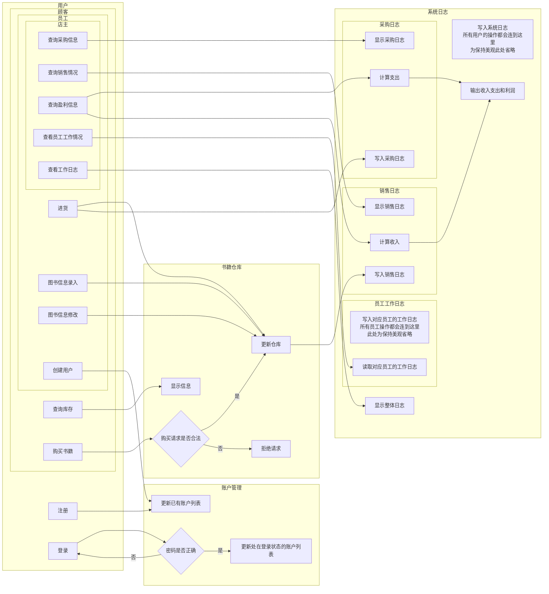
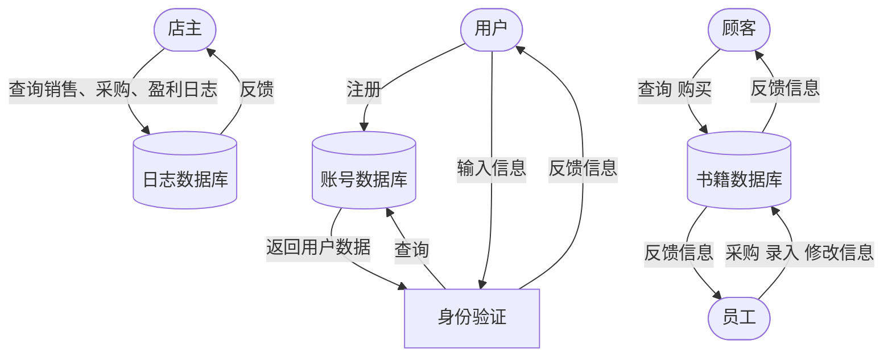

# 
Bookstore-2025 需求分析文档

## 
1.业务流图

## 
2.数据流图
Rmk：省略了所有操作向日志数据库的输入，每种功能仅用一个用户类型表示

## 
3.数据词典
| 数据项名称 | 含义                     | 类型                                               |
|-----|------------------------|--------------------------------------------------|
| 用户信息| 用户名+登录密码               | 字符串/字符串                                          |
|书籍| ISBN号+作者名字+关键字+书名/库存量/单价 | 字符串（20位）/字符串（60位）/字符串（60位）/字符串（总共不超过60位）/整型/非负实型 |
|操作记录| 时间+操作执行者+操作内容          | 字符串/字符串/字符串                                      |

## 
4.功能说明
### 书店系统包含以下模块：
1. **User模块**
   1. 描述：User类是项目中用于执行不同类型用户发出指令的核心类 （继承关系：User -> Customer -> Seller -> Manager）
   2. 功能：（1~2属于基类 3~4属于Customer类 5~8属于Seller类 9~13属于Manager类）
      1. **Register**：输入用户信息，把新用户信息存入Account的对象
      2. **LogIn**：输入用户信息，判断是否登录成功
      3. **Inquiry**：输入书籍关键词信息，调用Repository模块找到书籍信息
      4. **Buy**：输入书籍信息和购买数量，调用Repository模块修改库存
      5. **Import**：输入书籍信息和采购数量，调用Repository模块修改库存
      6. **Add**：输入新书信息，调用Repository模块添加书籍信息
      7. **Modify**：输入书籍信息和需要修改的内容，调用Repository模块修改库存
      8. **CreateAccount**：输入用户信息，调用Account模块创建账户
      9. **CheckImport**：输入查询时间段，调用Log模块输出采购日志
      10. **CheckSell**：输入查询时间段，调用Log模块输出销售日志
      11. **CheckProfit**：输入查询时间段，调用Log模块输出该时间段内收入支出和利润情况
      12. **MonitorWork**：输入员工信息和时间段，调用Log模块输出该时间段内被查询员工的操作情况
      13. **FetchLog**：输入查询时间段，调用Log模块输出时间段内的所有操作记录

2. **Repository模块**
   1. 描述：用于在文档中增加、修改和读取库存书籍数据
   2. 功能：
      1. **AddNewBook**：输入完整的新书信息，写入文档
      2. **FindBook**：输入给出的信息关键词，找到并返回文档中该数据信息的位置
      3. **ModifyBook**：输入要修改的书籍在文档中的位置，和需要修改的数据项，写入修改后的数据

3. **Account模块**
   1. 描述：集中管理系统运行期间创建的用户，管理账户的登录情况，从文件中读写用户数据。
   2. 功能：
      1. **AddAccount**：输入User信息，写入文档存储
      2. **FindAccount**：查找User信息

4. **Log模块**
   1. 描述：按时间顺序记录系统运行的全过程，支持在文档中写入和读取
   2. 功能：
      1. **CheckImport**：输入查询时间段，从文档中读取进货信息并输出
      2. **CheckSell**：输入查询时间段，从文档中读取销售信息并输出
      3. **CheckProfit**：输入查询时间段，从文档中读取进货和销售信息，输出收入支出和盈利
      4. **CheckWork**：输入查询时间段和员工用户名，从文档中读取员工的操作信息并输出
      5. **FetchLog**输入查询的时间段，从文档中读取并输出该时间段的所有操作信息

5.**Error模块**
   1. 描述：在各种操作指令不可执行时抛出错误
## 
5.用户交互设计
进入系统初始化：Welcome to bookstore management system!

输出提示信息：r for register, l for log in.

注册：r [用户属性] [用户名] [密码] 

反馈：Register successfully!

登录：l [用户名] [密码]

反馈：Log in successfully!/Account not found!/Wrong password!

若登录成功输出：Hi [用户类型] [用户名]. What can I do for you?

输出该用户类型可以执行的操作指南：
* Customer：r for register, l for log in, in for inquiry, b for buy.
* Seller：……（同上）, im for import, a for add, mo for modify, ac for add account.
* Manager:……, cim for check import, cs for check sell, cp for check profit, mw for monitor work,fl for fetch log.

查询：in [……]……（若干个关键词）

购买：b [ISBN号] [购买数量]

进货：im [ISBN号] [数量] [进货价格]

录入书籍信息：a [ISBN号] [书名] [作者] [关键字] [库存量] [单价]

修改图书信息：mo [ISBN号] [修改的项目] [修改后的值]

查询各种信息：[op] [开始时间] [结束时间]

查询员工工作情况：mw [员工用户名] [开始时间] [结束时间]

发出指令后若成功则在命令行界面输出：[op] successful!

若失败则输出：[op] failed!

