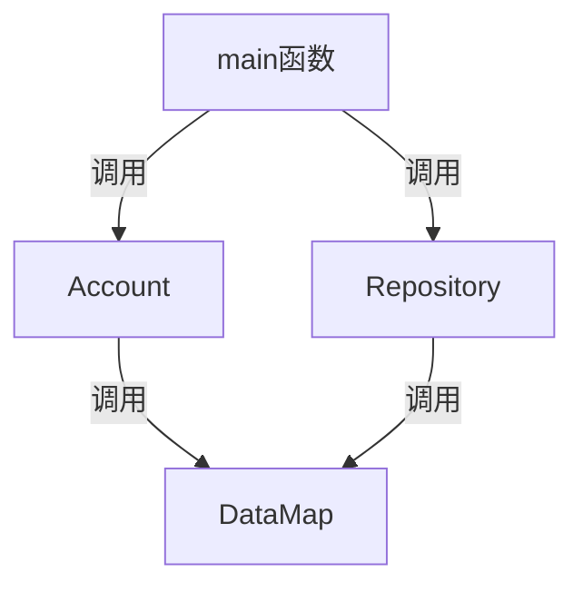

# <center>Bookstore-2025 总体设计文档

#### <center>作者：胡同语（InfinityHty）

## 1.程序功能概述
书店管理系统通过命令行与用户进行交互，能够管理不同权限的用户。不同权限的用户可以通过输入指令对库存书籍进行指定操作。其中店主还可以通过该系统查看运行日志，达到书店管理需求。
## 2.主体逻辑说明
1. 处理命令行指令输入：先读入一整行，将每个词视为一个token，利用sstream功能拆分成vector<string> tokens
2.

## 3.代码文件结构
main函数处理命令行指令，进入不同分支。main函数通过调用Account，Repository类里面封装的函数，实现对于账户和图书的操作。
调用Log类封装的函数，实现查询日志的操作。
Account类，Repository类的成员函数调用DataMap类，Memory类实现用户信息的读写查询修改等。
## 4.功能设计

## 5.数据库设计
账户管理数据库：由于每个账户拥有不重复的UserID，存储时将UserID作为index，User结构体作为value，利用DataMap存入文件。
（此处2个文件）

书籍管理数据库：由于每本书的检索指标较多，可以给每个ISBN号对应的书分配一个BookID。BookID在文件里按顺序从小到大。

数据库分为两部分，一部分是BookID到Book结构体的映射
（此处1个文件）
另一部分以搜索关键词（包括ISBN、BookName、Author、Keyword）为index，BookID为value
构建4张map，分别表示ISBN到BookID，BookName到BookID，Author到BookID，Keyword到BookID的映射
map的结构采用块状链表实现（这里有8个文件）

日志记录数据库：按操作顺序把每条操作记录封装成Record结构体，直接存入一个文件
## 6.类、结构体设计（有待修改）
#### User类
封装了用户的个人信息，包括UserID，UserName，Password，Privilege
作为一个整体写入文件
结构体封装情况如下：
```
class User {
public:
    char UserID[35];
    char Username[35];
    char Password[35];
    int Privilege;
    User();
    User(std::string UserID,std::string User_name, std::string Password_,int privilege = 0): Privilege(privilege){
        int cnt = 0;
        memset(Username, 0, 35);
        memset(Password, 0, 35);
        while (User_name[cnt] != '\0') Username[cnt] = User_name[cnt],cnt++;
        cnt = 0;
        while (Password_[cnt] != '\0') Password[cnt] = Password_[cnt],cnt++;
    }
    void NewPassword(std::string new_password) {
        memset(Password, 0, 35);
        int cnt = 0;
        while (new_password[cnt] != '\0') Password[cnt] = new_password[cnt],cnt++;
    }
};
```
#### Account类
提供管理账户的函数接口给main函数，并封装了登录状态栈
Account类通过调用DataMap获取用户信息
```
class User;
class Book;
class Account {
public:
    bool ValidCheck(std::string& s);// 检查UserID，Password是否合法
    void AddNewAccount(User& user);
    void LogIn(User user);
    void ChangeInfo(User user);
    User GetUser(std::string id);
    bool LogOut();
    bool FindUser(std::string id);
    bool HasLogIn(std::string name);
    int GetLoginNumber() const {
        return login_number;
    }
    void DeleteAccount(User user);
    User CurrentUser();
private:
    std::string filename = "account.txt";
    std::string index_filename = "index_account.txt";
    std::vector<User> LogInStack;
    int login_number = 0;
    User current_user;
};
```
#### DataMap类
实现外存上键和值的对应，用于用户的查找，书籍的查找
```
template <class T1,class T2,int block_size = 1>
// 基于块状链表存储的Map类模板
class Database {
private:
    std::fstream file;
    std::fstream index_file;
    int node_number = 0;
    struct Content {
        T1 index;
        T2 value;
    };
    struct Node {
        T1 max_key,min_key;
        int body_size;
        long long next_node = -1;
        long long content_pos;
    };
    static bool cmp (const Content &c1,const Content &c2) {
        if (c1.index < c2.index) return true;
        else if (c1.index > c2.index) return false;
        else {
            return c1.value < c2.value;// 升序排序
        }
    }
public:
    void Initialize();
    void Insert(T1 index,T2 value);
    void Delete(T1 index,T2 value);
    void Find(T1 index);//适用于书籍管理，查找索引为index的内容并输出
    T2 GetValue(T1 index);// 适用于账户管理（一个index只对应一个value），返回value
    bool CheckExist(T1 index);// 适用于账户管理，查询是否存在这个用户

```
#### Book类
封装一本书的所有信息
```
class Book {
public:
    char ISBN[25];
    char BookName[65],Author[65],Keyword[65];
    int Quantity;
    float Price;// 保留小数点后两位
    Book();

};
```
#### Repository类
提供管理图书的函数接口给main函数

#### Record类
封装一条操作记录信息
## 7.补充说明


