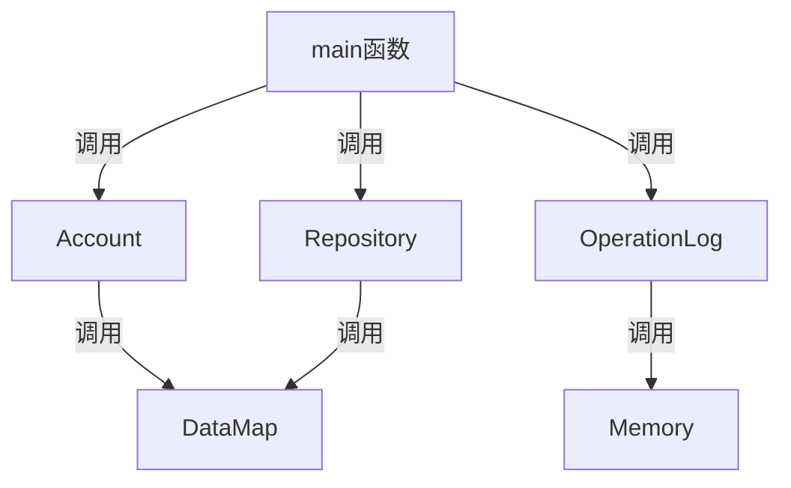

# <center>Bookstore-2025 总体设计文档

#### <center>作者：胡同语（InfinityHty）

## 1.程序功能概述
书店管理系统通过命令行与用户进行交互，能够管理不同权限的用户。不同权限的用户可以通过输入指令对库存书籍进行指定操作。其中店主还可以通过该系统查看运行日志，达到书店管理需求。
## 2.主体逻辑说明
1. 处理命令行指令输入：先读入一整行，将每个词视为一个token，利用sstream功能拆分成vector<string> tokens
2. 在main函数中通过if-else语句区分不同模块指令
3. 程序启动运行时自动创建root用户（如果之前已经创建则忽略），运行过程中维护当前用户、用户登录栈、当前选择的书籍、书籍选择栈等信息，并且每条操作都会以string或者User+string绑定的形式记录在log文件中
4. 对于日志的维护，将收入支出信息单独存放在一个memory river中以供show finance指令快速查询，其它所有操作信息存放在log文件中，需要查询时逐一遍历
5. 由于命令行输入类型是string，但在块状链表中需要定长存储，因此需要string->array<char,[n]>的类型转换函数，写在main开头
## 3.代码文件结构
main函数处理命令行指令，进入不同分支。main函数通过调用Account，Repository，OperationLog类里面封装的函数，实现对于账户、图书和日志的操作。
Account类，Repository类的成员函数调用DataMap类，OperationLog类成员函数调用Memory类实现用户信息的读写查询修改等。
## 4.功能设计

## 5.数据库设计
账户管理数据库：由于每个账户拥有不重复的UserID，存储时将UserID作为index，User结构体作为value，利用DataMap存入文件。
（此处2个文件）

书籍管理数据库：
数据库分为两部分，一部分是ISBN（每本书的不重复标识）到Book结构体的映射
（此处2个文件）
另一部分以搜索关键词（包括BookName、Author、Keyword）为index，ISBN为value
构建3张map，分别表示BookName到ISBN，Author到ISBN，Keyword到ISBN的映射（此处把keyword按|分隔拆开）
map的结构采用块状链表实现（这里有6个文件）

日志记录数据库：
按操作顺序把每条操作记录封装成Record结构体，直接存入一个文件
当系统执行buy和import操作时，把交易金额写入记录交易顺序情况的memory中，采用数组实现
（此处2个文件）

## 6.类、结构体设计
#### User类
封装了用户的个人信息，包括UserID，UserName，Password，Privilege
作为一个整体写入文件，以UserID为不重复索引重载了比较运算符
结构体封装情况如下：
```
#ifndef NEEDANALYSIS_MD_USER_H
#define NEEDANALYSIS_MD_USER_H
#include <cstring>
#include<string>
#include<array>
class User {
public:
    std::array<char,30> UserID{};
    std::array<char,30> Username{};
    std::array<char,30> Password{};
    int Privilege;
    User() {
        Privilege = 0;
    }
    User(std::string User_ID,std::string User_name, std::string Password_,int privilege = 0): Privilege(privilege){
        int cnt = 0;
        while (User_ID[cnt] != '\0') UserID[cnt] = User_ID[cnt],cnt++;
        cnt = 0;
        while (User_name[cnt] != '\0') Username[cnt] = User_name[cnt],cnt++;
        cnt = 0;
        while (Password_[cnt] != '\0') Password[cnt] = Password_[cnt],cnt++;
    }
    void NewPassword(std::string new_password) {
        int cnt = 0;
        for (int i = 0; i < 30; i++) Password[i] = '\0';
        while (new_password[cnt] != '\0') Password[cnt] = new_password[cnt],cnt++;
    }
    bool operator==(const User& other) const{
        return UserID == other.UserID;
    }
    bool operator <(const User& other) const{
        return UserID < other.UserID;
    }
    bool operator >(const User& other) const{
        return UserID > other.UserID;
    }
    bool operator <=(const User& other) const{
        return UserID <= other.UserID;
    }
    bool operator >=(const User& other) const{
        return UserID >= other.UserID;
    }
    bool operator !=(const User& other) const{
        return UserID != other.UserID;
    }
};
```
#### Account类
提供管理账户的函数接口给main函数，并封装了登录状态栈
Account类通过调用DataMap获取用户信息
```
class User;
class Book;
class Account {
public:
    bool ValidCheck(std::string& s);// 检查UserID，Password是否合法
    void AddNewAccount(User& user);
    void LogIn(User user);
    void ChangeInfo(User user);
    User GetUser(std::string id);
    bool LogOut();
    bool FindUser(std::string id);
    bool HasLogIn(std::string name);
    int GetLoginNumber() const {
        return login_number;
    }
    void DeleteAccount(User user);
    User CurrentUser();
private:
    std::string filename = "account.txt";
    std::string index_filename = "index_account.txt";
    std::vector<User> LogInStack;
    int login_number = 0;
    User current_user;
};
```
#### DataMap类
实现外存上键和值的对应，用于用户的查找，书籍的查找

ps.在后续实现过程中，发现原有的块状链表模板在处理节点被删空后重新加入数据的情况时存在问题，
故在Node中加入了对前一个节点的存储，改为双向链表，并加入了头节点
```
template <class T1,class T2,int block_size = 1>
// 基于块状链表存储的Map类模板
class Database {
private:
    std::fstream file;
    std::fstream index_file;
    int node_number = 1;
    struct Content {
        T1 index;
        T2 value;
    };
    struct Node {
        T1 max_key,min_key;
        int body_size;
        long long next_node = -1;
        long long pre_node = -1;
        long long content_pos;
    };
    static bool cmp (const Content &c1,const Content &c2) {
        if (c1.index < c2.index) return true;
        else if (c1.index > c2.index) return false;
        else {
            return c1.value < c2.value;// 升序排序
        }
    }
public:
    void Initialize();
    void Insert(T1 index,T2 value);
    void Delete(T1 index,T2 value);
    void Find(T1 index);//适用于书籍管理，查找索引为index的内容并输出
    void SplitBlock(Node target,long long cur_pos);// 裂块
    T2 GetValue(T1 index);// 适用于一个index只对应一个value的情形（ISBN、UserID作为index时），返回value
    bool CheckExist(T1 index);// 检查是否存在该index
    void ChangeInfo(T1 index,T2 new_value);// 修改信息
    void ShowAll();// 显示所有（书籍）信息
    std::vector<T2> ReturnValues(T1 index);// 在书籍管理系统中一个index可能对应多个value，将所有符合要求的value存入vector一起返回
```
#### Book类
封装一本书的所有信息，同样重载了比较运算符，
同时show指令要求输出所有符合条件的书，因此重载了<<作为友元函数
```
class Book {
public:
    std::array<char,20> ISBN{};
    std::array<char,60> BookName{};
    std::array<char,60> Author{};
    std::array<char,60> Keyword{};
    int Quantity = 0;// 库存数量
    long double Price = 0;// 保留小数点后两位
    Book() = default;
    Book(std::string isbn,std::string bookname,std::string author,std::string keyword,int quantity,long double price) : Quantity(quantity), Price(price){
        int cnt = 0;
        while (isbn[cnt] != '\0') ISBN[cnt] = isbn[cnt],cnt++;
        cnt = 0;
        while (bookname[cnt] != '\0') BookName[cnt] = bookname[cnt],cnt++;
        cnt = 0;
        while (author[cnt] != '\0') Author[cnt] = author[cnt],cnt++;
        cnt = 0;
        while (keyword[cnt] != '\0') Keyword[cnt] = keyword[cnt],cnt++;

    }
    bool operator==(const Book& book) const {
        return ISBN == book.ISBN;
    }
    bool operator<(const Book& book) const {
        return ISBN < book.ISBN;
    }
    bool operator>(const Book& book) const {
        return ISBN > book.ISBN;
    }
    bool operator<=(const Book& book) const {
        return ISBN <= book.ISBN;
    }
    bool operator>=(const Book& book) const {
        return ISBN >= book.ISBN;
    }
    friend std::ostream& operator<<(std::ostream& os, const Book& book);

};
```
#### Repository类
提供管理图书的函数接口给main函数，接口如下
```
class Repository {
public:
    void Initialize();
    bool FindBook(std::string isbn);
    void ChangeInfo(Book& book);
    int ComputeQuantity(std::string quantity);
    Book GetABook(std::string isbn);
    Book GetABook2(std::array<char,20> isbn);
    void AddNewBook(Book& book);
    long double ComputeCost(std::string cost);
    void Parser(std::string line,std::string& type,std::vector<std::string>& index);
    void DeleteBook(Book& book);
    void ShowAll();
    void PrintExistingBooks(std::string& type,std::string& index);
    std::vector<std::string> MultipleKeywords(std::array<char,60> keyword);
    bool RepeatKeywords(std::vector<std::string> keywords);
    std::array<char,60> GetKeywords(std::string lines);
    void LogIn(Book& book);
    void LogOut();
    Book GetSelectedBook();
    void ChangeSelectedBook(Book& book);
    void ModifySelectedBook(Book& pre_book,Book& new_book);
private:
    std::string filename_isbn = "isbn.txt";
    std::string index_isbn = "index_isbn.txt";
    std::string filename_name = "name.txt";
    std::string index_name = "index_name.txt";
    std::string filename_author = "author.txt";
    std::string index_author = "index_author.txt";
    std::string filename_keyword = "keyword.txt";
    std::string index_keyword = "index_keyword.txt";
    std::vector<Book> selected_list{};
};
```
#### OperationLog类
封装一条操作记录信息，接口如下
```
class OperationLog {
private:
    struct Record {
        User user;
        std::array<char,100> operation{};
    }record_;
    std::string filename_trade = "trade.txt";
    //std::vector<float> trade{};
public:
    int trade_cnt;// 总交易笔数
    int record_num; // 总有效操作条数
    void Initialize();
    int ComputeCount(std::string);
    void ShowFinance(int cnt);
    void NewInOut(long double num);
    void AddRecord(User user,std::string instruction);
    void ShowRecord();
    void ReportFinance();
    void ReportEmployee();
};
```
## 7.补充说明
1. 由于本书店管理系统对于书籍信息的存储方式以ISBN作为桥梁，每次进行修改操作时都需要在Repository类中删除四个文件中原有的映射，然后插入四个新的映射，
这样操作效率较低
2. 为了保证块状链表中Content的固定长度，设置了大量string和array之间的类型互转，使得代码冗余
3. 主体逻辑全部写在main函数里比较繁琐
4. 对于一些特殊情况的处理考虑不全面导致inner subtask3未能通过
5. 对于已经放在书籍选择栈里的书籍，如果对这些书籍的信息作出修改，在logout时需要重新从数据库里获取更新


